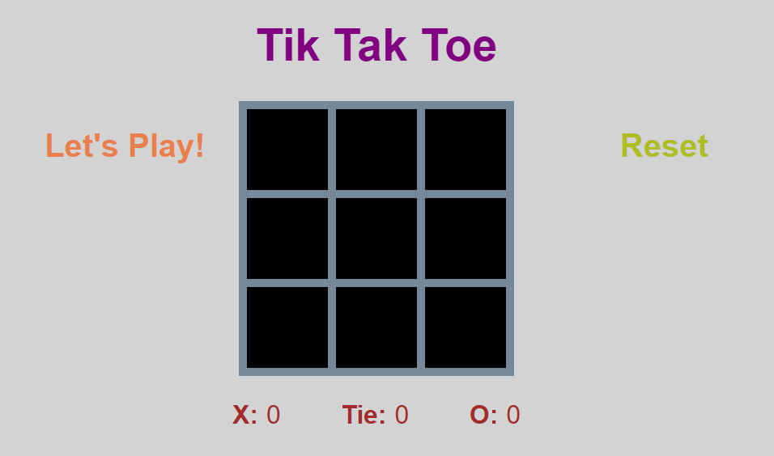

# Tic Tac Toe

## List
* Technologiess
* How it works

## Technologies
1. HTML
2. JavaScript
3. CSS

## How it works
* A user can click on different squares to make a move.
* Every click will alternate between marking an `X` and `O`
* Display which turn is about to be played.
* Display the winning case.
* Have a reset button to start new game
* Track player's wins over time

 
